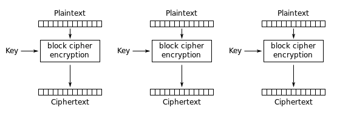
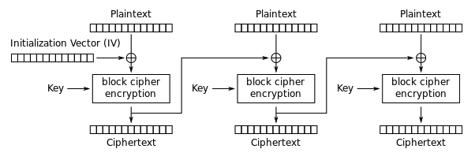
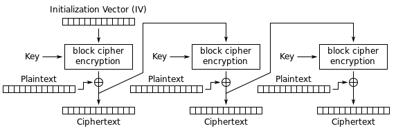
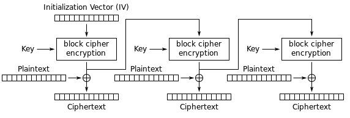
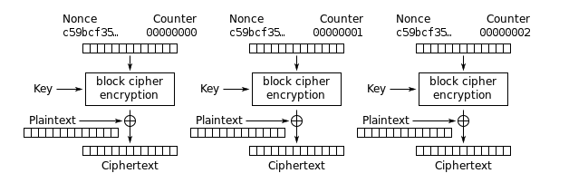

## RC4

### Шифрування

* #### Ініціалізація S-блоку

Цей алгоритм використовує ключ, що подається на вхід користувачем, збережений в Key, і має довжину L байт. 
Ініціалізація починається з заповнення масиву S, далі цей масив перемішується шляхом перестановок, які визначаються 
ключем.

* #### Генерація псевдовипадкового слова K 

Генератор ключового потоку RC4 переставляє значення, що зберігаються в S. В одному циклі RC4 визначається одне n-бітове
слово K з ключового потоку.

* #### Додавання за модулем 2 (XOR)

Ключове слово, яке було отримано з мінулого кроку, складено по модулю два з вихідним текстом, яке користувач хоче 
зашифрувати та отримано зашифрований текст.

### Розшифрування

Повторюємо 1 та 2 пункти Шифрування. Потім потік бітів ключа складається з шифрограмою операцією «xor»

## Salsa20

### Шифрування

#### quarterround(y)

Для кожного слова ми складаємо два попередніх, зсуваємо (циклічно) суму на певну кількість біт і побітово підсумовуємо 
результат з вибраним словом. 

#### rowround(y)

В цьому перетворенні ми беремо 16 слів. Представимо їх у вигляді матриці 4х4. Беремо кожен рядок цієї матриці і 
перетворимо слова цієї матриці функцією quarterround(y). Слова з рядка беруться за порядком, починаючи з i-го для i-го 
рядка, де i={0,1,2,3}.

#### columnround(y)

Тут ми беремо стовпці такої ж матриці. Перетворимо їх функцією за аналогією підставляючи в неї значення, починаючи з 
j-го для j-го стовпця, де j={0,1,2,3}.

#### doubleround(y)

Функція doubleround(y) є послідовним застосуванням функцій columnround а потім rowround:  
doubleround(y) = rowround(columnround(y))

#### Salsa20_hash()

Даний алгоритм використовує запис слова, що починається з молодшого байта. Для цього тут введено перетворення

Нехай — 4-байтова послідовність, тоді — слово, таке, що

littleendian(b) = b0 + 2^8 b1 + 2^16 b2 + 2^24 b3

Підсумкове перетворення — це побітове додавання вихідної послідовності і результату 20 раундів почергових перетворень 
стовпців і рядків.

Salsa20_hash(x) = x + doubleround^{10}(x)

## AES ECB

## AES CBC

## AES CFB 

## AES OFB

## AES CTR

